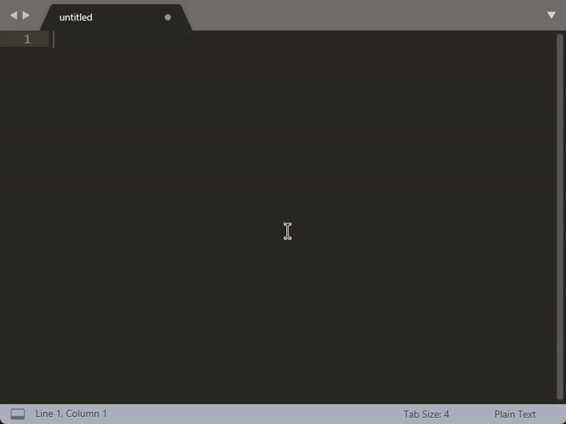
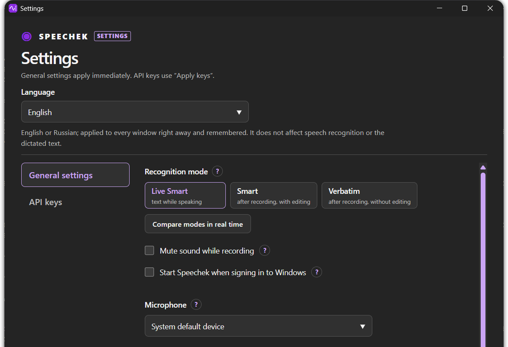

# Speechek

**Dictate instead of typing. Free, with Gemini quality.**

Press a key, say what you want to write, and the text lands in the field you're typing in. 
Windows 11, no subscription, no local models, no powerful GPU.

### [⬇️ Download for Windows](https://github.com/girte/speechek/releases/latest)

**English** · [Русский](README.ru.md)

**Contents:** [How it works](#how-it-works) · [Why Speechek](#why-speechek) · [Three modes](#three-modes) · [Get started](#get-started) · [Hotkeys](#hotkeys) · [Settings](#settings) · [Privacy and limits](#privacy-and-limits) · [FAQ](#faq)

## How it works

1. Put the cursor where the text should go: a chat, an email, a document, a prompt box.
2. Press **F2** and talk. A small pill on the screen shows that Speechek is listening.
3. Press **F2** again. Gemini recognizes the recording, and Speechek pastes the finished text into the field.

Changed your mind halfway? Press **Esc**. The recording is dropped, nothing gets pasted, and your clipboard stays as it was. Audio that has already reached Gemini can't be called back, though.

## Why Speechek

**💸 Free dictation within Google's free quotas.** The app is free and has no subscription. The Gemini models it uses are free of charge on the Google AI Free Tier, as long as you stay within Google's current quotas and terms.

**🔑 More keys, more headroom, if they come from different projects.** Add keys from several Google projects, and Speechek spreads your dictations across them. No single project takes the whole load, and you never switch keys by hand. Google counts limits per project, so two keys from the same project share one quota and add nothing.

**✨ Ready-to-use text, no local models.** The Smart modes drop filler words and format your speech by meaning, so you can send it as a message or drop it into a document. Nothing to download, no powerful GPU to buy.

**🎛️ Three modes, so you don't force every task into one style.** Recognition while you speak, a cleaned-up version after you stop, or your exact words. See below.

## Three modes

| Mode | What you get |
| --- | --- |
| **Live Smart** *(default)* | Recognition runs while you talk, with filler words removed and formatting by meaning. The final text is pasted once you stop. |
| **Smart** | The whole recording is processed after you stop: filler words go, the speech is formatted into usable text. |
| **Verbatim** | Your original wording, without Smart editing. Handy when the exact words matter. |

Not sure which one fits you? Open **Settings → General settings → Compare modes in real time**, record once, and see all three results side by side. Keep in mind that one take there is three Gemini requests against your quota.

## Get started

### 1. Install

Download `Speechek_<version>_x64-setup.exe` from **[Releases](https://github.com/girte/speechek/releases/latest)** and run it. It installs for your Windows user only, so no admin rights are needed. The installer offers a desktop shortcut and starting Speechek when you sign in; both are off unless you tick them. If Microsoft WebView2 is missing, the installer downloads it.

Windows says "Windows protected your PC"

The installer isn't code-signed yet: there is no paid signing certificate. SmartScreen may show a warning; click **More info → Run anyway**. Smart App Control or a strict company policy can block unsigned apps completely, and then Speechek won't start on that PC.

### 2. Get a free Gemini API key

1. Open **[Google AI Studio → API keys](https://aistudio.google.com/apikey)** and sign in with your Google account.
2. Accept the terms. On your first visit AI Studio creates a project and a key for you. If it doesn't, create a project right in AI Studio and click **Create API key**.
3. Copy the key.

You don't need to add a payment method: the Free Tier works on a project without billing.

How to get more headroom with several keys

Google applies limits to the whole project, not to each key, so several keys inside one project share one quota. For more free dictation, create a **separate project for each key** right in AI Studio and make one key in each. AI Studio also shows each project's usage. Speechek then takes the keys in turn, one per dictation.

If Gemini rejects the key chosen for a dictation, that dictation ends with an error. Speechek doesn't retry it on the next key.

### 3. Add the key to Speechek

Speechek lives in the system tray and has no main window. Right-click its icon → **Settings** → **API keys** tab → paste the key (several keys go one per line) → **Apply keys**.

**Check keys** confirms that a key can reach the Gemini API. It doesn't show how much quota is left.

> [!TIP]
> Pressed F2 before adding a key? Speechek opens this settings window for you instead of recording.

### 4. Dictate

Cursor in a text field → **F2** → speak → **F2**. That's it.

## Hotkeys

| Key | What it does |
| --- | --- |
| **F2** | Start recording; press again to stop and paste the text |
| **Esc** | Cancel the current dictation before the text is pasted |
| **Ctrl+V** | Paste manually when the pill says **Copied — paste manually**: the text is already on your clipboard |

Want a different key? Type it in **Settings → General settings → Hotkey**, for example `Ctrl+Shift+Space`, and press Enter.

## Settings

The language switch at the top of the settings window (English or Русский) changes the interface instantly, without a restart. The **General settings** tab applies right away too:

- **Recognition mode**: Live Smart, Smart or Verbatim.
- **Microphone**: the system default or a specific device.
- **Mute sound while recording**: silences Windows playback while the microphone is on and restores it afterwards. Off by default.
- **Start Speechek when signing in to Windows.**
- **Hotkey.**

The only exception is the local port, which you'll hardly ever need: it applies after a restart.

API keys are different: they take effect only after you click **Apply keys**.

Screenshot: the settings window

## Privacy and limits

> [!IMPORTANT]
> Speechek works through the cloud: your speech is sent to Google for recognition. On the Free Tier, Google may use what you send to improve its products, and that includes human review. Don't dictate anything confidential.

- You need an internet connection, a microphone and a country where the [Gemini API is available](https://ai.google.dev/gemini-api/docs/available-regions). There is no offline mode.
- Your API keys are encrypted with Windows DPAPI for your user account and stored in `%APPDATA%\Speechek\secrets.bin`, never as plain text. Recordings aren't saved to files.
- The Free Tier, quotas and available models are up to Google and can change. On a paid project, requests may be billed.
- Several keys don't make a failed request succeed: if Gemini rejects a key, Speechek doesn't retry on another one.

The full details, including what Speechek can and can't guarantee, are in the [user guide](docs/user-guide.md#privacy-and-limitations).

## FAQ

<b>Is it really free?</b>

The app is free and open source (MIT). Recognition runs on your own Gemini key, and on the Free Tier Google doesn't charge for these models within its quotas. If you turn on billing for the project, requests may be billed.

<b>Why do I need my own key?</b>

Speechek has no servers of its own. The app on your PC sends the audio straight to Gemini under your Google project, so the free quota is yours and nobody sits in between.

<b>What happens when the free quota runs out?</b>

Google rejects requests until the limit resets; daily limits reset at midnight Pacific time. Keys from other projects add independent headroom, see [several keys](#2-get-a-free-gemini-api-key).

<b>The text didn't get pasted. Where is it?</b>

If Speechek can't confirm the paste, the pill shows **Copied — paste manually**. The text is already on the clipboard: click into the field and press **Ctrl+V**.

<b>Does it work offline?</b>

No. Recognition happens on Google's side, so Speechek needs the internet.

<b>How do I update?</b>

Download the new `*-setup.exe` from [Releases](https://github.com/girte/speechek/releases) and run it. It updates in place and keeps your settings and keys. Speechek doesn't update itself.

<b>How do I uninstall?</b>

**Windows Settings → Apps → Installed apps → Speechek → Uninstall.** Your settings and keys stay on the PC unless you tick **Delete settings and API keys** in the uninstaller.

## Documentation

- [User guide](docs/user-guide.md) · [Руководство](docs/user-guide.ru.md): keys, every setting, files, updates, uninstall, troubleshooting.
- [Changelog](CHANGELOG.md) · [Releases](https://github.com/girte/speechek/releases)
- [Contributing](CONTRIBUTING.md): building from source, portable Development builds, checks and localization.
- [Releasing](docs/releasing.md): how official builds are made and published.

## License

Speechek's code is released under the [MIT License](LICENSE). The clipboard paste mechanism is adapted from [Handy](https://github.com/cjpais/Handy) (MIT); its license is kept in [`third_party/Handy.LICENSE`](third_party/Handy.LICENSE). Notices for third-party components bundled into the app and installer ship with each release.
