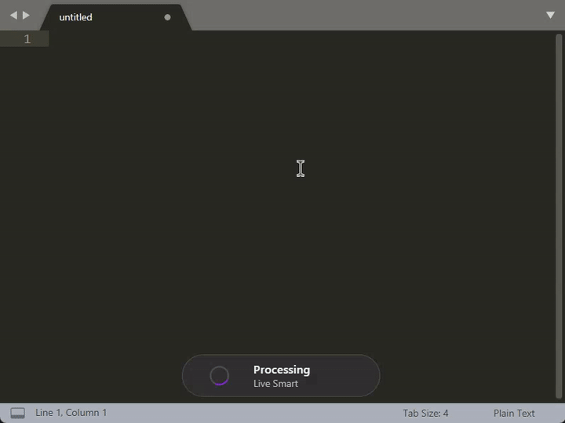
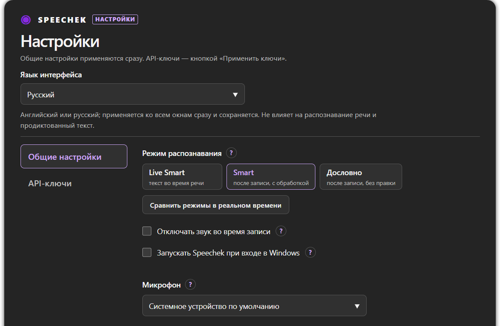

# Speechek

**Диктуйте вместо печати. Бесплатно, с качеством Gemini.**

Нажали клавишу, сказали, что хотели написать, и текст уже в поле, где стоит курсор. 
Windows 11, без подписки, без локальных моделей и мощной видеокарты.

### [⬇️ Скачать для Windows](https://github.com/girte/speechek/releases/latest)

[English](README.md) · **Русский**

**Содержание:** [Как это работает](#как-это-работает) · [Почему Speechek](#почему-speechek) · [Три режима](#три-режима) · [Быстрый старт](#быстрый-старт) · [Горячие клавиши](#горячие-клавиши) · [Настройки](#настройки) · [Приватность и ограничения](#приватность-и-ограничения) · [Вопросы и ответы](#вопросы-и-ответы)

## Как это работает

1. Поставьте курсор туда, где нужен текст: в чат, письмо, документ, окно запроса.
2. Нажмите **F2** и говорите. Небольшая плашка на экране покажет, что идёт запись.
3. Нажмите **F2** ещё раз. Gemini распознает запись, а Speechek вставит готовый текст в поле.

Передумали на середине? Нажмите **Esc**. Запись пропадёт, ничего не вставится, а буфер обмена останется прежним. Правда, звук, который уже ушёл в Gemini, отозвать нельзя.

## Почему Speechek

**💸 Диктовка без оплаты в пределах бесплатных квот Google.** Приложение бесплатное, подписки нет. Модели Gemini, которыми оно пользуется, на бесплатном уровне Google AI ничего не стоят, пока вы укладываетесь в текущие квоты и условия Google.

**🔑 Больше ключей — больше бесплатных запросов, если ключи из разных проектов.** Добавьте ключи нескольких проектов Google, и Speechek будет распределять между ними диктовки. Нагрузка не ложится на один проект, а переключать ключи вручную не нужно. Google считает лимиты на проект, поэтому два ключа одного проекта делят одну квоту и ничего не добавляют.

**✨ Готовый текст без локальных моделей.** Smart-режимы убирают слова-паразиты и форматируют речь по смыслу, так что результат можно сразу отправить в сообщении или вставить в документ. Скачивать ничего не нужно, мощную видеокарту покупать тоже.

**🎛️ Три режима, чтобы не подгонять все задачи под один способ диктовки.** Распознавание прямо во время речи, очищенный вариант после остановки или ваши слова как есть. Подробнее ниже.

## Три режима

| Режим | Что получаете |
| --- | --- |
| **Live Smart** *(по умолчанию)* | Распознавание идёт, пока вы говорите: слова-паразиты убираются, текст форматируется по смыслу. Итог вставляется после остановки. |
| **Smart** | Вся запись обрабатывается после остановки: слова-паразиты уходят, речь превращается в удобный текст. |
| **Дословно** | Ваши формулировки без Smart-правки. Пригодится, когда важны именно ваши слова. |

Не знаете, что выбрать? Откройте **Настройка → Общие настройки → Сравнить режимы в реальном времени**, запишите одну фразу и посмотрите на три результата рядом. Учтите, что одна такая запись — это три запроса к Gemini из вашей квоты.

## Быстрый старт

### 1. Установите

Скачайте `Speechek_<версия>_x64-setup.exe` со страницы **[Releases](https://github.com/girte/speechek/releases/latest)** и запустите. Установщик ставит приложение только для вашей учётной записи Windows, права администратора не нужны. Он предложит ярлык на рабочем столе и запуск при входе в Windows; обе галочки сняты, пока вы их не поставите. Если Microsoft WebView2 не установлен, установщик скачает его сам.

Windows пишет «Система Windows защитила ваш компьютер»

Установщик пока не подписан: платного сертификата подписи нет. SmartScreen может показать предупреждение; нажмите **Подробнее → Выполнить в любом случае**. Smart App Control или строгая политика компании могут полностью запретить неподписанные приложения, и тогда на этом компьютере Speechek не запустится.

### 2. Получите бесплатный ключ Gemini API

1. Откройте **[Google AI Studio → API keys](https://aistudio.google.com/apikey)** и войдите в аккаунт Google.
2. Примите условия. Если вы в AI Studio впервые, он сам создаст проект и ключ. Если проекты Google Cloud у вас уже есть, импортируйте нужный (**Dashboard → Projects → Import projects**) и нажмите **Create API key**.
3. Скопируйте ключ.

Привязывать карту не нужно: бесплатный уровень работает в проекте без оплаты.

Как получить больше бесплатных запросов с несколькими ключами

Google ограничивает весь проект, а не каждый ключ отдельно. Чтобы бесплатной диктовки действительно стало больше, кладите каждый следующий ключ в **другой проект**: создайте проект в [Google Cloud Console](https://console.cloud.google.com/projectcreate), импортируйте его в AI Studio (**Dashboard → Projects → Import projects**) и выпустите ключ там. Speechek будет брать ключи по очереди, по одному на диктовку.

Если Gemini отклонит ключ, выбранный для диктовки, она завершится ошибкой. Повторять её на следующем ключе Speechek не будет.

### 3. Добавьте ключ в Speechek

Speechek живёт в системном трее, главного окна у него нет. Правый щелчок по значку → **Настройка** → вкладка **API-ключи** → вставьте ключ (несколько ключей — по одному на строку) → **Применить ключи**.

**Проверить ключи** подтверждает, что ключ получает доступ к Gemini API. Остаток квоты эта кнопка не показывает.

> [!TIP]
> Нажали F2 до того, как добавили ключ? Speechek не начнёт запись, а откроет это окно настроек.

### 4. Диктуйте

Курсор в текстовом поле → **F2** → говорите → **F2**. Вот и всё.

## Горячие клавиши

| Клавиша | Что делает |
| --- | --- |
| **F2** | Начать запись; повторное нажатие останавливает её и вставляет текст |
| **Esc** | Отменить текущую диктовку, пока текст ещё не вставлен |
| **Ctrl+V** | Вставить вручную, если плашка пишет **Скопировано — вставьте вручную**: текст уже в буфере обмена |

Хотите другую клавишу? Впишите её в **Настройка → Общие настройки → Горячая клавиша**, например `Ctrl+Shift+Space`, и нажмите Enter.

## Настройки

Переключатель языка вверху окна настроек (English или Русский) меняет интерфейс мгновенно, перезапуск не нужен. Вкладка **Общие настройки** тоже применяется сразу:

- **Режим распознавания**: Live Smart, Smart или Дословно.
- **Микрофон**: системный по умолчанию или конкретное устройство.
- **Отключать звук во время записи**: выключает звук Windows, пока работает микрофон, и возвращает его после. По умолчанию выключено.
- **Запускать Speechek при входе в Windows.**
- **Горячая клавиша.**

Исключение одно — локальный порт, который вам вряд ли понадобится: он применяется после перезапуска.

С API-ключами иначе: они начинают действовать только после кнопки **Применить ключи**.

Скриншот: окно настроек

## Приватность и ограничения

> [!IMPORTANT]
> Speechek работает через облако: ваша речь отправляется Google на распознавание. На бесплатном уровне Google может использовать отправленное для улучшения своих продуктов, в том числе с проверкой людьми. Не диктуйте конфиденциальное.

- Нужны интернет, микрофон и страна, где [доступен Gemini API](https://ai.google.dev/gemini-api/docs/available-regions). России в этом списке сейчас нет (проверено в октябре 2026). Офлайн-режима нет.
- API-ключи шифруются средствами Windows DPAPI для вашей учётной записи и лежат в `%APPDATA%\Speechek\secrets.bin`, в открытом виде нигде не хранятся. Записи не сохраняются в файлы.
- Бесплатный уровень, квоты и доступные модели определяет Google, и они могут меняться. В платном проекте запросы могут тарифицироваться.
- Несколько ключей не спасают неудачный запрос: если Gemini отклонит ключ, Speechek не повторит запрос на другом.

Все подробности, включая то, что Speechek может и чего не может гарантировать, — в [руководстве](docs/user-guide.ru.md#приватность-и-ограничения).

## Вопросы и ответы

<b>Это правда бесплатно?</b>

Приложение бесплатное, код открыт (MIT). Распознавание работает на вашем ключе Gemini, и на бесплатном уровне Google не берёт плату за эти модели в пределах квот. Если включить оплату в проекте, запросы могут тарифицироваться.

<b>Зачем нужен собственный ключ?</b>

Своих серверов у Speechek нет. Приложение на вашем компьютере отправляет звук напрямую в Gemini от имени вашего проекта Google: бесплатная квота ваша, посредников нет.

<b>Что будет, когда закончится бесплатная квота?</b>

Google будет отклонять запросы, пока лимит не обновится; суточные лимиты сбрасываются в полночь по тихоокеанскому времени. Ключи из других проектов дают дополнительную бесплатную квоту, см. [несколько ключей](#2-получите-бесплатный-ключ-gemini-api).

<b>Текст не вставился. Где он?</b>

Если Speechek не может подтвердить вставку, плашка пишет **Скопировано — вставьте вручную**. Текст уже в буфере обмена: щёлкните в нужное поле и нажмите **Ctrl+V**.

<b>Работает без интернета?</b>

Нет. Распознавание идёт на стороне Google, поэтому Speechek нужен интернет.

<b>Как обновить?</b>

Скачайте новый `*-setup.exe` со страницы [Releases](https://github.com/girte/speechek/releases) и запустите. Он обновит приложение на месте и сохранит настройки и ключи. Сам Speechek не обновляется.

<b>Как удалить?</b>

**Параметры Windows → Приложения → Установленные приложения → Speechek → Удалить.** Настройки и ключи останутся на компьютере, если в удалителе не поставить галочку **Удалить настройки и API-ключи**.

## Документация

- [Руководство](docs/user-guide.ru.md) · [User guide](docs/user-guide.md): ключи, все настройки, файлы, обновление, удаление, диагностика.
- [История изменений](CHANGELOG.md) · [Releases](https://github.com/girte/speechek/releases)
- [Участие в разработке](CONTRIBUTING.md) (на английском): сборка из исходников, portable-сборки Development, проверки и локализация.
- [Как выпускаются релизы](docs/releasing.md) (на английском): сборка и публикация официальных версий.

## Лицензия

Код Speechek распространяется по [лицензии MIT](LICENSE). Механизм вставки через буфер обмена адаптирован из [Handy](https://github.com/cjpais/Handy) (MIT); его лицензия хранится в [`third_party/Handy.LICENSE`](third_party/Handy.LICENSE). Уведомления о сторонних компонентах, встроенных в приложение и установщик, поставляются с каждым выпуском.
